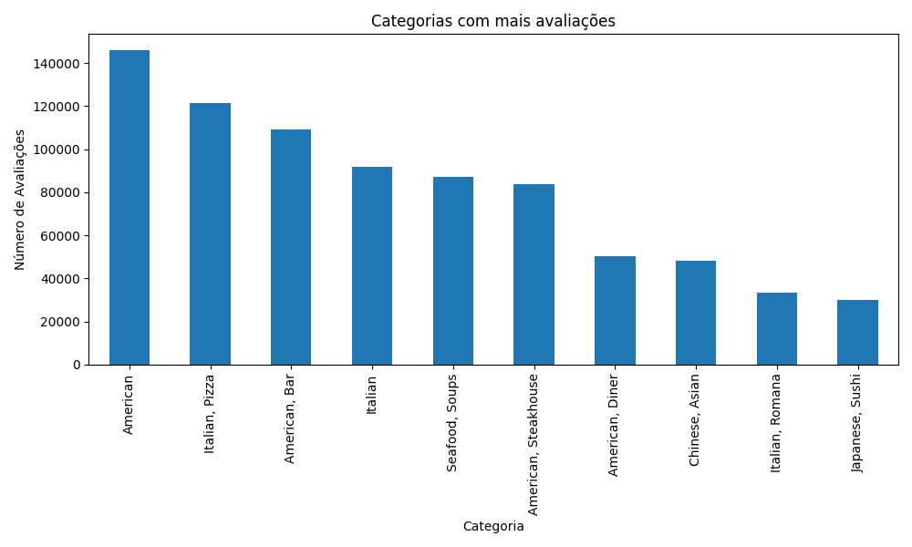
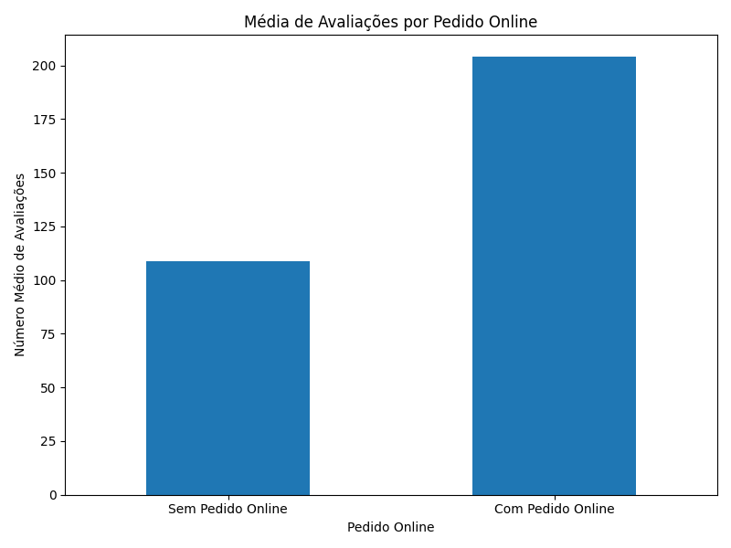
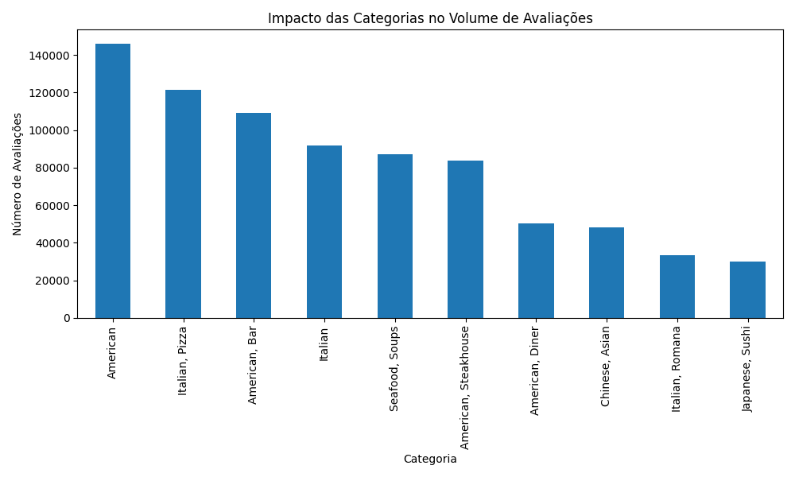

# Projeto: Análise de Dados de Restaurantes - Trip Advisor NYC

Este projeto realiza uma análise exploratória de dados de restaurantes em Nova York, utilizando um dataset com mais de 10 mil registros do Trip Advisor.

## Objetivo do Projeto
O objetivo principal é responder a perguntas relacionadas à popularidade, categorias de culinária e fatores que impactam o volume de avaliações. O projeto também explora tendências em pratos populares e a influência de pedidos online.

## Perguntas de Análise

1. **Categorias de comida com mais avaliações**  
   Quais tipos de culinária (por exemplo, italiana, japonesa, americana) recebem o maior volume de avaliações? Como essas categorias se comparam em termos de popularidade?
   - **Insight:** As categorias **"American"** e **"Italian, Pizza"** lideram o volume de avaliações, com 146.189 e 121.418, respectivamente. Esses dados refletem uma clara preferência por culinárias tradicionais nos Estados Unidos.
   - **Gráfico:**  
     

2. **Relação entre número de avaliações e pedidos online**  
   Restaurantes que oferecem pedidos online ou delivery recebem mais avaliações ou maior engajamento dos clientes do que aqueles sem essa opção?
   - **Insight:** Restaurantes com pedidos online recebem, em média, **204 avaliações**, enquanto aqueles sem essa opção recebem apenas **108**, sugerindo que a conveniência é um fator importante para os consumidores.
   - **Gráfico:**  
     

3. **Pratos mais populares por categoria**  
   Quais pratos específicos são mais frequentemente mencionados em cada categoria de culinária?
   - **Insight:** Apesar de menções a pratos como **"lobster"** e **"cacio e pepe"**, categorias amplas como **"American"** apresentam maior diversidade nos menus, sem um prato específico predominante.

4. **Restaurante com maior número de avaliações**  
   Quais restaurantes se destacam pelo volume de avaliações e quais fatores parecem contribuir para esse alto engajamento?
   - **Insight:** O restaurante **"Ellen's Stardust Diner"** lidera com **22.604 avaliações**. Sua localização central e temas diferenciados podem justificar esse alto engajamento.

5. **Distribuição do número de avaliações**  
   Como o número de avaliações está distribuído entre os restaurantes? Há muitos restaurantes com poucas avaliações e poucos com muitas (distribuição desigual)?
   - **Insight:** A maioria dos restaurantes possui poucas avaliações, enquanto um pequeno número de outliers é altamente avaliado.
   - **Gráfico:**  
     

6. **Impacto das categorias no volume de avaliações**  
   Restaurantes com categorias específicas possuem consistentemente mais avaliações em comparação a outras categorias ou combinações?
   - **Insight:** Categorias amplas como **"American"** apresentam maior volume de avaliações, enquanto combinações específicas (e.g., **"Italian, Romana"**) possuem engajamento menor, mas ainda significativo.
   - **Gráfico:**  
     

## Estrutura do Projeto

1. **Pré-processamento de Dados**  
   - Limpeza e padronização das colunas do dataset.
   - Conversão de dados para formatos apropriados.

2. **Análise Exploratória de Dados (EDA)**  
   - Responder às perguntas listadas acima com visualizações e estatísticas descritivas.

3. **Geração de Relatório PDF**  
   - O script inclui a criação de um relatório consolidado em PDF contendo gráficos, tabelas e insights gerados durante a análise.
   - Arquivo gerado: `relatorio_analise_restaurantes.pdf`

4. **Dashboard Interativo (Streamlit)**  
   - Um painel interativo foi implementado utilizando Streamlit para visualização dinâmica das análises.
   - Para rodar o dashboard:
     ```bash
     streamlit run main.py
     ```

5. **Resultados e Conclusões**  
   - Geração de insights acionáveis a partir dos dados analisados.

## Arquivos Gerados

### **Gráficos**
1. `categorias_com_mais_avaliacoes.png` - Categorias com mais avaliações.  
2. `categorias_com_mais_avaliacoes_enhanced.png` - Versão aprimorada do gráfico de categorias.  
3. `media_avaliacoes_pedido_online.png` - Relação entre avaliações e pedidos online.  
4. `media_avaliacoes_pedido_online_enhanced.png` - Versão aprimorada do gráfico de pedidos online.  
5. `distribuicao_avaliacoes.png` - Distribuição do número de avaliações.  
6. `distribuicao_avaliacoes_enhanced.png` - Versão aprimorada do gráfico de distribuição de avaliações.  
7. `impacto_categorias.png` - Impacto das categorias no volume de avaliações.  
8. `impacto_categorias_enhanced.png` - Versão aprimorada do gráfico de impacto.  
9. `avg_reviews_online_order.png` - Média de avaliações por pedidos online.  
10. `top_categories_reviews.png` - Gráfico de categorias com mais avaliações.

### **Tabelas**
1. `popular_dishes_by_category.csv` - Pratos populares por categoria.  
2. `top_reviewed_restaurant.csv` - Restaurante mais avaliado.  
3. `top_restaurants_by_category.csv` - Top restaurantes por categoria.  
4. `cleaned_data.csv` - Dataset após limpeza e padronização.  
5. `preview_data.csv` - Amostra de 100 linhas do dataset.

### **Relatório**
1. `relatorio_analise_restaurantes.pdf` - Relatório consolidado em PDF com os insights e gráficos gerados.

## Tecnologias Utilizadas

- **Linguagem:** Python  
- **Bibliotecas:** pandas, matplotlib, seaborn, fpdf, Streamlit  
- **Ferramentas:** PyCharm, Git  

## Como Executar

1. Clone este repositório:
   ```bash
   git clone <url_do_repositorio>
   ```

2. Instale as dependências:
   ```bash
   pip install -r requirements.txt
   ```

3. Execute o script principal para análise de dados:
   ```bash
   python main.py
   ```

4. Para visualizar o dashboard interativo:
   ```bash
   streamlit run main.py
   ```

5. Para gerar o relatório PDF:
   Certifique-se de que as análises foram realizadas e o script `main.py` foi executado corretamente. O PDF será gerado automaticamente no diretório principal do projeto.
