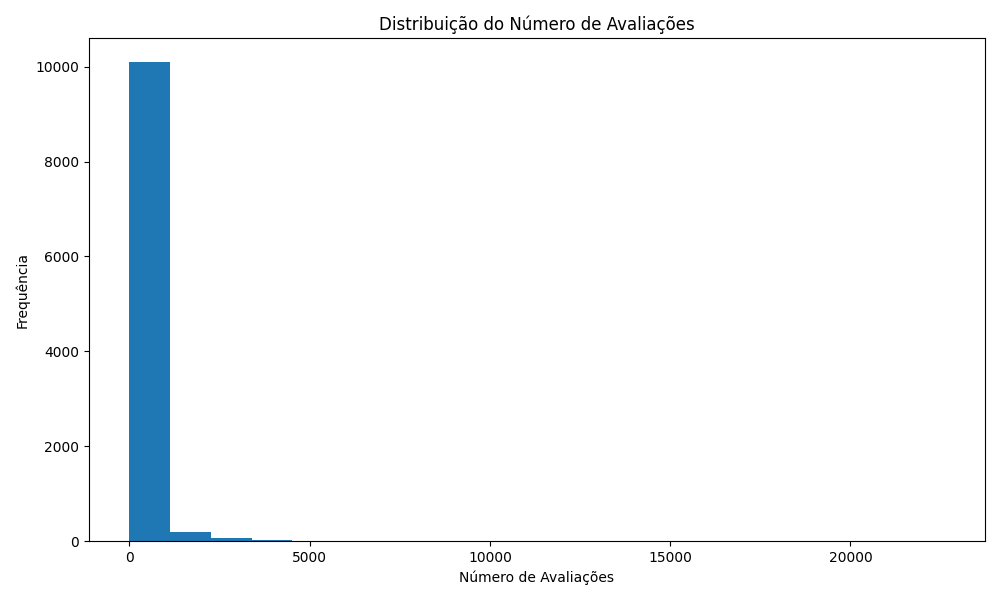

# Projeto: Análise de Dados de Restaurantes - Trip Advisor NYC

Este projeto realiza uma análise exploratória de dados de restaurantes em Nova York, usando um dataset com mais de 10 mil registros do Trip Advisor.

## Objetivo do Projeto
O objetivo principal é responder a perguntas relacionadas à popularidade, categorias de culinária, e fatores que impactam o volume de avaliações. O projeto também explora tendências em pratos populares e a influência de pedidos online.

## Perguntas de Análise
1. **Categorias de comida com mais avaliações**  
   Quais tipos de culinária (por exemplo, italiana, japonesa, americana) recebem o maior volume de avaliações? Como essas categorias se comparam em termos de popularidade?

   - **Insight:** As categorias "American" e "Italian, Pizza" lideram o volume de avaliações, com 146.189 e 121.418, respectivamente. Esses dados refletem uma clara preferência por culinárias tradicionais nos Estados Unidos.
   - **Gráfico:** 

2. **Relação entre número de avaliações e pedidos online**  
   Restaurantes que oferecem pedidos online ou delivery recebem mais avaliações ou melhor engajamento dos clientes do que aqueles sem essa opção?

   - **Insight:** Restaurantes com pedidos online recebem uma média de 204 avaliações, enquanto aqueles sem essa opção recebem apenas 108, sugerindo que a conveniência é um fator importante para os consumidores.
   - **Gráfico:** 

3. **Pratos mais populares por categoria**  
   Quais pratos específicos são mais frequentemente mencionados em cada categoria de culinária?

   - **Insight:** Apesar das menções a pratos como "lobster" e "cacio e pepe", categorias com pratos populares variados (e.g., "American") não possuem um prato específico predominante, indicando diversidade nos menus.

4. **Restaurante com maior número de avaliações**  
   Quais restaurantes se destacam pelo volume de avaliações e quais fatores parecem contribuir para esse alto engajamento?

   - **Insight:** O restaurante "Ellen's Stardust Diner" tem o maior número de avaliações (22.604). Sua localização central e temas diferenciados podem justificar esse engajamento.

5. **Distribuição do número de avaliações**  
   Como o número de avaliações está distribuído entre os restaurantes? Existem muitos restaurantes com poucas avaliações e poucos com muitas (distribuição desigual)?

   - **Insight:** A distribuição mostra que a maioria dos restaurantes possui poucas avaliações, com um pequeno número de outliers altamente avaliados.
   - **Gráfico:** 

6. **Impacto das categorias no volume de avaliações**  
   Restaurantes com categorias de culinária específicas têm consistentemente mais avaliações em comparação a outras categorias ou combinações?

   - **Insight:** Categorias amplas como "American" possuem maior volume de avaliações, enquanto combinações específicas (e.g., "Italian, Romana") apresentam engajamento menor, mas ainda significativo.
   - **Gráfico:** 

## Estrutura do Projeto
1. **Pré-processamento de Dados**  
   - Limpeza e padronização das colunas.
   - Conversão de dados para formatos apropriados.

2. **Análise Exploratória de Dados (EDA)**  
   - Responder às perguntas listadas acima com visualizações e estatísticas descritivas.

3. **Resultados e Conclusões**  
   - Insights obtidos a partir dos dados.

## Tecnologias Utilizadas
- **Linguagem:** Python
- **Bibliotecas:** pandas, matplotlib, seaborn
- **Ferramentas:** PyCharm, Git

## Como Executar
1. Clone este repositório:
   ```bash
   git clone <url_do_repositorio>
   
2. Instale as dependências:
   ```bash
   pip install -r requirements.txt
   
3. Rode o script principal:
   ```bash
   python main.py

   

